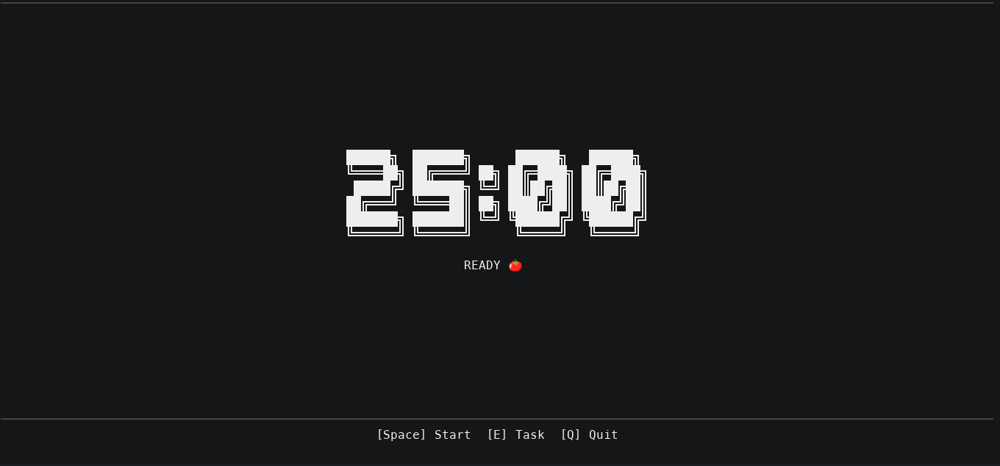

# tomatty 🍅

[](https://kernel.org)
[](https://bun.sh)
[](./LICENSE)

---

<!-- PORTUGUÊS -->

**[English version below](#what-is-it)**

## Sumário

- [O que é](#o-que-é)
- [O diferencial](#o-diferencial)
- [Por que desenvolvi](#por-que-desenvolvi)
- [Screenshots / Demo](#screenshots--demo)
- [Instalação rápida](#instalação-rápida)
- [Requisitos do sistema](#requisitos-do-sistema)
- [Como executar](#como-executar)
- [Como funciona](#como-funciona)
- [Configuração](#configuração)
- [Licença](#licença)

---

## O que é

**tomatty** é um timer Pomodoro que roda no terminal (TUI), construído com [Bun](https://bun.sh) e [@opentui/core](https://github.com/anomalyco/opentui).

Ele foi feito para quem estuda/trabalha no Linux e quer um timer que realmente te libera durante a pausa — sem precisar ficar olhando para o relógio ou lembrar de voltar ao computador.

## O diferencial

A maioria dos timers Pomodoro simplesmente toca um sino quando o tempo acaba e espera você agir. O **tomatty** faz diferente: ao término de uma sessão de trabalho, ele **suspende o sistema** (sleep/S3) com um alarme de RTC configurado para a duração do intervalo.

Isso significa:

- A máquina desliga a tela e entra em suspensão real — você se levanta sem culpa
- No final do intervalo, o hardware acorda automaticamente via RTC
- O tomatty exibe a tela de "bem-vindo de volta" com os dados da sessão
- Se você acordar o computador antes do alarme, ele detecta o "early wake" e mostra o tempo restante

Nenhum script de cron, nenhum daemon rodando em segundo plano. Só `sudo rtcwake`.

## Por que desenvolvi

Eu sou alguém que, quando focado/concentrado em algo, principalmente se for estudando algo pelo qual me interesso, difícilmente dou uma pausa por conta própria, espero a exaustão e o estresse me pararem.

Por isso decidi criar o **tomatty**. Uma ferramenta simples de terminal, porém poderosa por causa de uma simples funcionalidade: *pausa forçada*. É tudo que eu preciso em um pomodoro para realmente descansar quando for para descansar.

Esse projeto reflete minha personalidade simples e gosto pelo minimalismo. Além disso, sempre quis ter um projeto de terminal (CLI ou TUI, tanto faz).

Como ainda sou estudante (e precisava de uma ferramenta dessas pra agora, justamente por isso), utilizei o Github Copilot integrado ao OpenCode para desenvolvê-lo.

## Screenshots / Demo



## Instalação rápida

```sh
curl -fsSL https://raw.githubusercontent.com/ivan-psg/tomatty/main/install.sh | bash
```

> O script detecta automaticamente a sua distro (Arch, Debian/Ubuntu, Fedora), instala as dependências necessárias, configura o `sudo` para o `rtcwake` e coloca o binário em `/usr/local/bin/tomatty`.

## Requisitos do sistema

| Requisito                           | Detalhes                                                                |
| ----------------------------------- | ----------------------------------------------------------------------- |
| **Sistema operacional**             | Linux x86-64 ou arm64                                                   |
| **Runtime**                         | [Bun](https://bun.sh) ≥ 1.0                                             |
| **`rtcwake`**                       | Fornecido pelo pacote `util-linux` (já presente na maioria das distros) |
| **`sudo` sem senha para `rtcwake`** | Necessário para suspender o sistema (ver configuração abaixo)           |
| **Terminal**                        | Suporte a cores TrueColor recomendado (kitty, alacritty, ghostty, etc.) |

### Configurando sudo para rtcwake

O tomatty precisa de permissão para chamar `rtcwake` sem senha. Configure uma vez:

```sh
echo "$USER ALL=(ALL) NOPASSWD: /usr/sbin/rtcwake" \
  | sudo tee /etc/sudoers.d/tomatty
```

## Como executar

### Desenvolvimento

```sh
# Instalar dependências
pnpm install   # ou: bun install

# Rodar com hot-reload
bun run dev
```

### Build (binário compilado)

```sh
bun run build
# Gera: dist/tomatty
```

O binário gerado é autocontido — inclui o runtime Bun e o código da aplicação. Basta copiar `dist/tomatty` para qualquer lugar no seu `$PATH`:

```sh
sudo cp dist/tomatty /usr/local/bin/tomatty
tomatty
```

> **Nota:** a biblioteca nativa `libopentui.so` é embutida no binário pelo `bun build --compile`. Nenhuma dependência extra é necessária em produção além do sudoers configurado.

### Argumentos de linha de comando

```
tomatty [opções]

Opções:
  -w, --worktime <minutos>   Define a duração da sessão de trabalho e salva
  -b, --breaktime <minutos>  Define a duração do intervalo e salva
  -d, --default              Restaura as durações padrão (25 min / 5 min) e salva
                             Não pode ser usado junto com -w ou -b
  -h, --help                 Exibe esta ajuda e encerra

Notas:
  As durações são persistidas em ~/.config/tomatty/settings.json e valem para
  todas as sessões futuras até serem alteradas novamente.
  Executar sem argumentos usa as durações salvas (padrão: 25 / 5).

Exemplos:
  tomatty                     # usa as durações salvas
  tomatty -w 45 -b 15         # define 45 min de trabalho e 15 min de pausa
  tomatty -w 50               # define 50 min de trabalho, mantém o intervalo atual
  tomatty -d                  # restaura para 25 / 5
```

## Como funciona

### Controles

| Tecla          | Ação                       |
| -------------- | -------------------------- |
| `Space`        | Iniciar / Pausar / Retomar |
| `R`            | Resetar sessão atual       |
| `E`            | Editar nome da tarefa      |
| `Q` / `Ctrl+C` | Sair                       |

### Máquina de estados

```
  [Space]            [Space]           fim do timer
   IDLE ──────────► WORKING ──────────► SUSPENDING
    ▲                  │ [Space]              │
    │                  ▼                     │ (sistema dorme e acorda)
    │               PAUSED                   ▼
    │                  │ [R]          IDLE_AFTER_BREAK
    └──────────────────┘                     │
                                      [Space]│
                                             └──► WORKING (nova sessão)
```

### Módulos

| Arquivo          | Responsabilidade                                                |
| ---------------- | --------------------------------------------------------------- |
| `src/index.ts`   | UI principal, loop de eventos, máquina de estados               |
| `src/timer.ts`   | Contagem regressiva orientada a delta-time (ticks do renderer)  |
| `src/suspend.ts` | Chama `sudo rtcwake` e aguarda o sistema retomar                |
| `src/storage.ts` | Persiste contagem de pomodoros em `~/.config/tomatty/data.json` |
| `src/panel.ts`   | Publica status em `~/.cache/tomatty/status.json` (painéis)      |
| `src/state.ts`   | Enum `AppState`                                                 |
| `src/config.ts`  | Durações, número de sessões por ciclo e paleta de cores         |

### Persistência

Os dados são salvos em `~/.config/tomatty/data.json`:

```json
{
  "date": "2026-03-09",
  "count": 3,
  "totalEver": 47
}
```

O contador diário (`count`) reseta automaticamente no dia seguinte. O total acumulado (`totalEver`) nunca é zerado.

### Status para painéis externos

Enquanto o tomatty está em execução, ele mantém o arquivo `~/.cache/tomatty/status.json` atualizado a cada segundo:

```json
{
  "state": "WORKING",
  "remaining": 1342,
  "taskName": "study",
  "updatedAt": "2026-03-09T14:30:18.000Z"
}
```

| Campo       | Tipo   | Descrição                                                             |
| ----------- | ------ | --------------------------------------------------------------------- |
| `state`     | string | `IDLE` \| `WORKING` \| `PAUSED` \| `SUSPENDING` \| `IDLE_AFTER_BREAK` |
| `remaining` | number | Segundos inteiros restantes na sessão atual                           |
| `taskName`  | string | Nome da tarefa atual (string vazia se não definida)                   |
| `updatedAt` | string | ISO 8601 do último update — útil para compensar latência de polling   |

O arquivo é **removido automaticamente** quando o tomatty encerra (`Q` / `Ctrl+C`), então a ausência do arquivo significa que o app não está rodando.

Nenhum painel exibe esse arquivo de forma automática — é necessário configurar um módulo/script em cada um. O processo geral é sempre o mesmo:

1. Criar o script `tomatty-panel`
2. Configurar o módulo no painel
3. Recarregar o painel

#### Passo 1 — Criar o script `tomatty-panel`

Crie o arquivo `~/.local/bin/tomatty-panel`:

```bash
#!/usr/bin/env bash
python3 - <<'PY'
import json, os, math
from datetime import datetime, timezone

p = os.path.expanduser("~/.cache/tomatty/status.json")
if not os.path.exists(p):
    print("🍅 off")
    raise SystemExit(0)

try:
    with open(p, "r", encoding="utf-8") as f:
        d = json.load(f)

    r = int(d.get("remaining", 0))
    s = d.get("state", "?")
    u = d.get("updatedAt", "")

    # Compensa latência de polling em sessões ativas
    if s == "WORKING" and u:
        t = datetime.fromisoformat(u.replace("Z", "+00:00"))
        age = (datetime.now(timezone.utc) - t).total_seconds()
        r = max(0, r - math.ceil(age))

    print(f"🍅 {r//60:02d}:{r%60:02d} [{s}]")
except Exception:
    print("🍅 --:-- [?]")
PY
```

Torne-o executável:

```sh
chmod +x ~/.local/bin/tomatty-panel
```

Verifique se `~/.local/bin` está no seu `$PATH`. Se não estiver, adicione ao `~/.bashrc` / `~/.zshrc`:

```sh
export PATH="$HOME/.local/bin:$PATH"
```

#### Passo 2 — Configurar no seu painel

---

**XFCE — xfce4-genmon-plugin**

Instale o plugin (se não tiver):

```sh
# Debian/Ubuntu
sudo apt install xfce4-genmon-plugin
# Arch
sudo pacman -S xfce4-genmon-plugin
```

No painel:

1. Clique com o botão direito no painel → **Adicionar novos itens**
2. Adicione **Generic Monitor**
3. Clique com o botão direito no item adicionado → **Propriedades**
4. Preencha:
   - **Command:** `tomatty-panel`
   - **Period:** `1` (segundos)
   - Desmarque **Label** (ou deixe vazio)
5. Clique em **Close**

---

**Waybar**

Em `~/.config/waybar/config`, adicione o módulo:

```json
"custom/tomatty": {
    "exec": "tomatty-panel",
    "interval": 1,
    "format": "{}",
    "return-type": ""
}
```

Adicione `"custom/tomatty"` à lista `"modules-left"`, `"modules-center"` ou `"modules-right"` conforme preferir. Depois recarregue:

```sh
killall waybar && waybar &
```

---

**Polybar**

Em `~/.config/polybar/config.ini`, adicione:

```ini
[module/tomatty]
type = custom/script
exec = tomatty-panel
interval = 1
```

Adicione `tomatty` aos módulos da barra (ex.: `modules-right = tomatty`). Depois recarregue:

```sh
polybar-msg cmd restart
```

---

**i3blocks**

Em `~/.config/i3blocks/config` (ou `/etc/i3blocks.conf`), adicione:

```ini
[tomatty]
command=tomatty-panel
interval=1
```

Adicione `i3blocks` na linha `status_command` do `~/.config/i3/config` se ainda não estiver:

```
bar {
    status_command i3blocks
}
```

Recarregue o i3:

```sh
i3-msg reload
```

---

**tmux**

Em `~/.tmux.conf`:

```sh
set -g status-right '#(tomatty-panel)'
set -g status-interval 1
```

Recarregue:

```sh
tmux source-file ~/.tmux.conf
```

---

**KDE Plasma — System Monitor widget**

O KDE não tem suporte nativo a scripts arbitrários na barra, mas é possível via **Command Output** widget:

1. Clique com o botão direito na barra → **Adicionar widgets**
2. Procure por **Command Output** (ou **Comando**)
3. Configure:
   - **Command:** `tomatty-panel`
   - **Update interval:** `1000` ms
4. Confirme e reposicione o widget

> Se o widget não estiver disponível, instale via **Obter novos widgets** na loja do KDE.

---

**GNOME Shell**

O GNOME não exibe texto arbitrário no top bar sem extensão. A opção mais simples é a extensão **[extensions.gnome.org — Custom Command Toggle](https://extensions.gnome.org/)** ou qualquer extensão que execute scripts shell no painel.

A mais usada para esse fim é o **[argos](https://github.com/p-e-w/argos)** (BitBar para GNOME):

1. Instale o argos via extensão GNOME
2. Crie `~/.config/argos/tomatty.1s.sh` (o `1s` define o intervalo):

```bash
#!/usr/bin/env bash
tomatty-panel
```

```sh
chmod +x ~/.config/argos/tomatty.1s.sh
```

O argos recarrega automaticamente.

#### Nota sobre latência

Todo painel baseado em **polling** (intervalo fixo de 1 s) pode apresentar até ~1 s de defasagem em relação ao timer real. O script `tomatty-panel` já compensa esse atraso usando o campo `updatedAt` quando o estado for `WORKING`. Nos demais estados (pausa, idle) a latência é irrelevante.

## Configuração

As durações são configuradas via argumentos de linha de comando e persistidas em `~/.config/tomatty/settings.json` (ver seção acima). Para alterar os valores padrão do binário, edite `src/config.ts` antes do build:

| Constante             | Padrão             | Descrição                                 |
| --------------------- | ------------------ | ----------------------------------------- |
| `WORK_DURATION`       | `25 * 60` (1500 s) | Duração da sessão de trabalho             |
| `BREAK_DURATION`      | `5 * 60` (300 s)   | Duração do intervalo / tempo de suspensão |
| `POMODOROS_PER_CYCLE` | `4`                | Pomodoros por ciclo (dots no header)      |
| `COLOR_WORK`          | `#E74C3C`          | Cor do modo trabalho                      |
| `COLOR_BREAK`         | `#2ECC71`          | Cor da tela de retorno                    |

## Licença

MIT © 2026 — veja [LICENSE](./LICENSE)

---

---

<!-- ENGLISH -->

**[Versão em português acima](#o-que-é)**

## Table of contents

- [What is it](#what-is-it)
- [What makes it different](#what-makes-it-different)
- [Why I built it](#why-i-built-it)
- [Screenshots / Demo](#screenshots--demo-1)
- [Quick install](#quick-install)
- [System requirements](#system-requirements)
- [Running the project](#running-the-project)
- [How it works](#how-it-works)
- [Configuration](#configuration)
- [License](#license)

---

## What is it

**tomatty** is a terminal-based Pomodoro timer (TUI), built with [Bun](https://bun.sh) and [@opentui/core](https://github.com/anomalyco/opentui).

It was made for Linux users who want a timer that actually frees you during breaks — no watching the clock, no remembering to come back.

## What makes it different

Most Pomodoro timers simply ring a bell when time is up and wait for you to act. **tomatty** does something else: when a work session ends, it **suspends the system** (sleep/S3) with an RTC alarm set for the duration of the break.

This means:

- The screen turns off and the machine enters real suspend — you step away guilt-free
- At the end of the break, the hardware wakes automatically via RTC alarm
- tomatty shows a "welcome back" screen with session stats
- If you wake the machine early, it detects the early wake and shows the remaining time

No cron job, no background daemon. Just `sudo rtcwake`.

## Why I built it

I'm someone who, when focused on something — especially studying a topic I find genuinely interesting — rarely takes a break on my own. I tend to wait until exhaustion and stress force me to stop.

That's why I built **tomatty**. A simple terminal tool, yet powerful because of one specific feature: *forced breaks*. That's all I need from a Pomodoro timer to actually rest when it's time to rest.

This project also reflects my straightforward personality and taste for minimalism. On top of that, I had always wanted a terminal project of my own — CLI or TUI, didn't matter.

Since I'm still a student (and needed a tool like this right now, for exactly that reason), I used GitHub Copilot integrated with OpenCode to develop it.

## Screenshots / Demo


## Quick install

```sh
curl -fsSL https://raw.githubusercontent.com/ivan-psg/tomatty/main/install.sh | bash
```

> The script auto-detects your distro (Arch, Debian/Ubuntu, Fedora), installs required dependencies, configures passwordless `sudo` for `rtcwake`, and places the binary at `/usr/local/bin/tomatty`.

## System requirements

| Requirement                           | Details                                                         |
| ------------------------------------- | --------------------------------------------------------------- |
| **OS**                                | Linux x86-64 or arm64                                           |
| **Runtime**                           | [Bun](https://bun.sh) ≥ 1.0                                     |
| **`rtcwake`**                         | Provided by the `util-linux` package (present on most distros)  |
| **Passwordless `sudo` for `rtcwake`** | Required to suspend the system (see setup below)                |
| **Terminal**                          | TrueColor support recommended (kitty, alacritty, ghostty, etc.) |

### Configuring sudo for rtcwake

tomatty needs permission to call `rtcwake` without a password prompt. Set it up once:

```sh
echo "$USER ALL=(ALL) NOPASSWD: /usr/sbin/rtcwake" \
  | sudo tee /etc/sudoers.d/tomatty
```

## Running the project

### Development

```sh
# Install dependencies
pnpm install   # or: bun install

# Run with hot-reload
bun run dev
```

### Build (compiled binary)

```sh
bun run build
# Output: dist/tomatty
```

The resulting binary is self-contained — it bundles the Bun runtime and all application code. Just copy `dist/tomatty` anywhere on your `$PATH`:

```sh
sudo cp dist/tomatty /usr/local/bin/tomatty
tomatty
```

> **Note:** the native `libopentui.so` library is embedded into the binary by `bun build --compile`. No extra dependencies are needed in production beyond the sudoers entry above.

### Command-line arguments

```
tomatty [options]

Options:
  -w, --worktime <minutes>   Set work session duration in minutes and save it
  -b, --breaktime <minutes>  Set break duration in minutes and save it
  -d, --default              Reset durations to defaults (25 min / 5 min) and save
                             Cannot be used together with -w or -b
  -h, --help                 Show this help message and exit

Notes:
  Duration changes are persisted to ~/.config/tomatty/settings.json and
  apply to every future session until changed again.
  Running tomatty without flags uses the last saved durations (default: 25 / 5).

Examples:
  tomatty                     # use saved durations
  tomatty -w 45 -b 15         # set 45-min work, 15-min break and start
  tomatty -w 50               # set 50-min work, keep current break time
  tomatty -d                  # reset to 25 / 5
```

## How it works

### Controls

| Key            | Action                 |
| -------------- | ---------------------- |
| `Space`        | Start / Pause / Resume |
| `R`            | Reset current session  |
| `E`            | Edit task name         |
| `Q` / `Ctrl+C` | Quit                   |

### State machine

```
  [Space]            [Space]          timer ends
   IDLE ──────────► WORKING ──────────► SUSPENDING
    ▲                  │ [Space]              │
    │                  ▼                     │ (system sleeps and wakes)
    │               PAUSED                   ▼
    │                  │ [R]          IDLE_AFTER_BREAK
    └──────────────────┘                     │
                                      [Space]│
                                             └──► WORKING (new session)
```

### Modules

| File             | Responsibility                                              |
| ---------------- | ----------------------------------------------------------- |
| `src/index.ts`   | Main UI, event loop, state machine                          |
| `src/timer.ts`   | Countdown driven by delta-time ticks from the renderer      |
| `src/suspend.ts` | Calls `sudo rtcwake` and waits for the system to resume     |
| `src/storage.ts` | Persists pomodoro counts to `~/.config/tomatty/data.json`   |
| `src/panel.ts`   | Publishes status to `~/.cache/tomatty/status.json` (panels) |
| `src/state.ts`   | `AppState` enum                                             |
| `src/config.ts`  | Durations, sessions-per-cycle and color palette             |

### Persistence

Data is stored at `~/.config/tomatty/data.json`:

```json
{
  "date": "2026-03-09",
  "count": 3,
  "totalEver": 47
}
```

The daily counter (`count`) resets automatically the next day. The cumulative total (`totalEver`) never resets.

### Panel integration

While tomatty is running it keeps `~/.cache/tomatty/status.json` updated every second:

```json
{
  "state": "WORKING",
  "remaining": 1342,
  "taskName": "study",
  "updatedAt": "2026-03-09T14:30:18.000Z"
}
```

| Field       | Type   | Description                                                              |
| ----------- | ------ | ------------------------------------------------------------------------ |
| `state`     | string | `IDLE` \| `WORKING` \| `PAUSED` \| `SUSPENDING` \| `IDLE_AFTER_BREAK`    |
| `remaining` | number | Integer seconds remaining in the current session                         |
| `taskName`  | string | Current task name (empty string if not set)                              |
| `updatedAt` | string | ISO 8601 timestamp of the last update — useful to compensate polling lag |

The file is **automatically removed** when tomatty exits (`Q` / `Ctrl+C`), so its absence means the app is not running.

No panel displays this file automatically — you need to configure a module/script in each one. The general process is always the same:

1. Create the `tomatty-panel` script
2. Configure the module in your panel
3. Reload the panel

#### Step 1 — Create the `tomatty-panel` script

Create the file `~/.local/bin/tomatty-panel`:

```bash
#!/usr/bin/env bash
python3 - <<'PY'
import json, os, math
from datetime import datetime, timezone

p = os.path.expanduser("~/.cache/tomatty/status.json")
if not os.path.exists(p):
    print("🍅 off")
    raise SystemExit(0)

try:
    with open(p, "r", encoding="utf-8") as f:
        d = json.load(f)

    r = int(d.get("remaining", 0))
    s = d.get("state", "?")
    u = d.get("updatedAt", "")

    # Compensate polling lag during active sessions
    if s == "WORKING" and u:
        t = datetime.fromisoformat(u.replace("Z", "+00:00"))
        age = (datetime.now(timezone.utc) - t).total_seconds()
        r = max(0, r - math.ceil(age))

    print(f"🍅 {r//60:02d}:{r%60:02d} [{s}]")
except Exception:
    print("🍅 --:-- [?]")
PY
```

Make it executable:

```sh
chmod +x ~/.local/bin/tomatty-panel
```

Make sure `~/.local/bin` is in your `$PATH`. If not, add it to `~/.bashrc` / `~/.zshrc`:

```sh
export PATH="$HOME/.local/bin:$PATH"
```

#### Step 2 — Configure in your panel

---

**XFCE — xfce4-genmon-plugin**

Install the plugin if needed:

```sh
# Debian/Ubuntu
sudo apt install xfce4-genmon-plugin
# Arch
sudo pacman -S xfce4-genmon-plugin
```

In the panel:

1. Right-click the panel → **Add New Items**
2. Add **Generic Monitor**
3. Right-click the new item → **Properties**
4. Fill in:
   - **Command:** `tomatty-panel`
   - **Period:** `1` (seconds)
   - Clear the **Label** field (optional)
5. Click **Close**

---

**Waybar**

In `~/.config/waybar/config`, add the module:

```json
"custom/tomatty": {
    "exec": "tomatty-panel",
    "interval": 1,
    "format": "{}",
    "return-type": ""
}
```

Add `"custom/tomatty"` to `"modules-left"`, `"modules-center"` or `"modules-right"` as preferred. Then reload:

```sh
killall waybar && waybar &
```

---

**Polybar**

In `~/.config/polybar/config.ini`, add:

```ini
[module/tomatty]
type = custom/script
exec = tomatty-panel
interval = 1
```

Add `tomatty` to the bar modules (e.g. `modules-right = tomatty`). Then reload:

```sh
polybar-msg cmd restart
```

---

**i3blocks**

In `~/.config/i3blocks/config` (or `/etc/i3blocks.conf`), add:

```ini
[tomatty]
command=tomatty-panel
interval=1
```

Make sure `i3blocks` is set as the `status_command` in `~/.config/i3/config`:

```
bar {
    status_command i3blocks
}
```

Reload i3:

```sh
i3-msg reload
```

---

**tmux**

In `~/.tmux.conf`:

```sh
set -g status-right '#(tomatty-panel)'
set -g status-interval 1
```

Reload:

```sh
tmux source-file ~/.tmux.conf
```

---

**KDE Plasma — System Monitor widget**

KDE does not natively run arbitrary scripts in the panel bar, but the **Command Output** widget works:

1. Right-click the panel → **Add Widgets**
2. Search for **Command Output**
3. Configure:
   - **Command:** `tomatty-panel`
   - **Update interval:** `1000` ms
4. Confirm and reposition the widget

> If the widget is unavailable, install it via **Get New Widgets** in the KDE store.

---

**GNOME Shell**

GNOME does not display arbitrary text in the top bar without an extension. The simplest option is **[argos](https://github.com/p-e-w/argos)** (BitBar for GNOME):

1. Install argos as a GNOME extension
2. Create `~/.config/argos/tomatty.1s.sh` (the `1s` sets the refresh interval):

```bash
#!/usr/bin/env bash
tomatty-panel
```

```sh
chmod +x ~/.config/argos/tomatty.1s.sh
```

argos reloads automatically.

#### Note on latency

All polling-based panels (fixed 1 s interval) may show up to ~1 s of lag behind the real timer. The `tomatty-panel` script already compensates for this using the `updatedAt` field when the state is `WORKING`. For other states (paused, idle) the latency is irrelevant.

## Configuration

Durations are configured via command-line arguments and persisted to `~/.config/tomatty/settings.json` (see section above). To change the built-in fallback defaults, edit `src/config.ts` before building:

| Constant              | Default            | Description                       |
| --------------------- | ------------------ | --------------------------------- |
| `WORK_DURATION`       | `25 * 60` (1500 s) | Work session duration             |
| `BREAK_DURATION`      | `5 * 60` (300 s)   | Break duration / suspend time     |
| `POMODOROS_PER_CYCLE` | `4`                | Pomodoros per cycle (header dots) |
| `COLOR_WORK`          | `#E74C3C`          | Work mode color                   |
| `COLOR_BREAK`         | `#2ECC71`          | Welcome-back screen color         |

## License

MIT © 2026 — see [LICENSE](./LICENSE)
